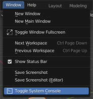
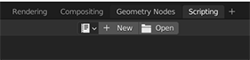
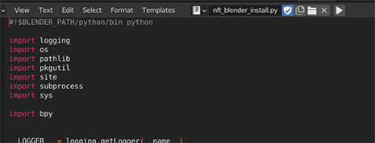
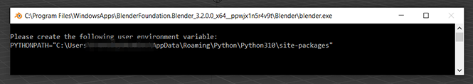
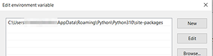
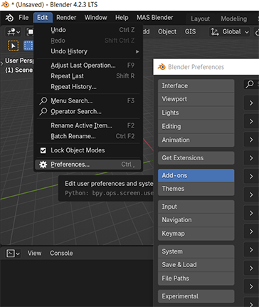
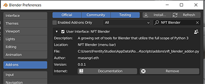

# **NFT Blender**
## **98% Tools for Blender...Not really just for NFTs**
A growing set of useful tools for Blender that utilizes the full scope of Python 3 beyond just what ships with Blender, by ***Mas***. 
This module conforms to the requirements of Python packaging, and can be installed **in Blender**, free of dependency issues & user complexity. 
### External libraries include:
- [PySide6](https://pypi.org/project/PySide6/)/[shiboken6](https://pypi.org/project/shiboken6/)
- [PyTest](https://pypi.org/project/pytest/) (dev only)
- [SQLAlchemy](https://pypi.org/project/SQLAlchemy/)
- [Web3](https://pypi.org/project/web3/) (eventually...it's on the "roadmap")

 

> This package is not yet meant for mainstream usage and delivered *as-is*. 
  Several scripts are specilized for custom in-house pipeline(s) (may eventually be made more customizable). 
  If you have ideas and/or run into issues with the module, please contact me! 😎

## Documentation
Documentation generated with readthedocs & Sphinx is deployed on GitHub Pages for this project automatically for every update.* 
To view the latest documentation for using **NFT Blender**, please visit: 
👉 [masangri.github.io/nft-blender](https://masangri.github.io/nft-blender/) 👈

## Installation
### Windows
1. Install Blender:
   - [Microsoft Store](https://apps.microsoft.com/store/detail/blender/9PP3C07GTVRH) 
     (recommended for users on shared machine) 
     
   - [MSI Installer](https://www.blender.org/download/)
2. Install Python 3.x (note: your version may differ from that in the screenshots):
   - [Microsoft Store](https://apps.microsoft.com/store/detail/python-39/9P7QFQMJRFP7)
     (recommended for users on shared machine) 
     
   - [Application](https://www.python.org/downloads/)
3. Install nft-blender module in Blender:
   1. Launch Blender. 
      
   2. Open the System Console window (Window > Toggle System Console). 
      
   3. Go to the *Scripting* tab. 
      
   4. Open and run the `nft_blender_install.py` script found in `scripts/` directory of the [NFT Blender repository](https://github.com/Masangri/nft-blender). 
      
   5. In the System Console window, copy the Windows path in the last line of the output. 
      
4. Include User's Python installation directory to list of Blender's `site-packages` locations:
   - Create PYTHONPATH environment variable for the user, if it doesn't yet exist.
   - Set the value to the Windows path from the System Console window in step 3.5 above. 
     
5. Close Blender and relaunch.
   - You will also be able to run `import nft_blender` directly to access the full `NFT Blender Add-On` module.
6. Install the `NFT Blender Add-On` and enable the custom menu:
   1. Open the Preferences window - in the main menu bar, go `Edit > Preferences...`. 
   2. Switch to the `Add-On...` section (left panel) and click the `Install` button (top panel). 
   
   3. Locate the `nft_blender_addon.py` script found in `scripts/` directory of the [NFT Blender repository](https://github.com/Masangri/nft-blender). 
   4. Enable the `NFT Blender Add-On` in the Preferences window. The `NFT Blender` custom menu will now be accessible via the main menu bar. 
   
    
   - Note that some tools are not yet accessible via the custom menu, and will need to be run from the *Scripting* tab by the user.

## Installation for Python Development
- Clone from GitHub: 
  > `git clone https://github.com/Masangri/nft-blender.git && cd nft-blender`
- As a project dependency: 
  > `pip install git+https://github.com/Masangri/nft-blender.git@main#egg=nft-blender`
